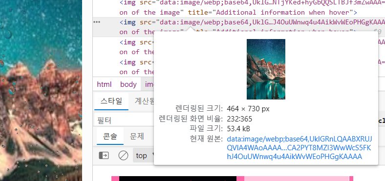
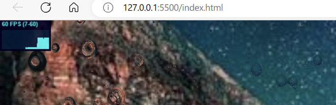

# 웹화면 동영상으로 만들기


```jsx
var captureFrames = setInterval(function () {
    // 캔버스를 이미지 데이터로 변환
    //여기서 문제가 생긴거였음!
    var dataURL = canvas.toDataURL("image/webp");
    var img = document.createElement("img");
    img.src = dataURL;
    img.alt = "Description of the image"; // add this line
    img.title = "Additional information when hover"; // add this line
    document.body.appendChild(img);

    // 이미지 데이터를 Whammy Video 객체에 추가
    video.add(canvas);
  }, interval);
```

이 부분에서 문제가 생긴 거였다.

위의 `var interval = 1000;`을 수정해봤는데 아래와 같이 그냥 천천히 나오는 거보면 이거 관련 문제는 아닌것 같고.



제대로 된 화면이 출력되게는 했는데… 즉, whammy.js 에서 멀쩡한 화면을 받을수 있게 했는데. 동영상이 여전히 검은색이다.

`이유 찾음` 😭

[JS audio加图片序列或canvas转webM/MP4的实现 «  张鑫旭-鑫空间-鑫生活](https://www.zhangxinxu.com/wordpress/2023/05/mp4-video-api-webcodecs-webm/comment-page-1/)

[GitHub - thenickdude/webm-writer-js: JavaScript-based WebM video encoder for Google Chrome](https://github.com/thenickdude/webm-writer-js)


됐다😂!!!

✨ 프레임 좀 더 높게 동영상 좀 더 길게

→ 코드 수정하면 되긴하는데 시간이 너무 오래걸림. 이거 해결하는 방법은 없을까? (최대 동영상 길이도 설정하면서 해봐야함.)




캡쳐할때는 위에처럼 연산량이 많아져서 비가 천천히 내려온다. 사실 오랫동안 찍으면 되는일이긴 한데, 이부분을 개선하는 방법을 찾아야함.

→ 그리고 현재 코드에선 아예 처음부터 동영상을 찍는걸로 코드를 만들어놨는데, 사용자가 버튼을 누르면 그때부터 찍는걸로 수정할것임 (slider의 값이 확립된 상태로 찍어야 하므로)

### 위에걸 mp4파일로 만들고 로컬에 저장.

> 이부분은 ffmpeg쓰게 서버한테 시키는게 대부분이긴 하다는데, 일단 최대한 라이브러리 사용해서 진행하는 쪽으로 생각해보겠음. -> 성능이슈가 생길수 있는 문제라 이후에 성능 안좋으면 서버로 수정한다.